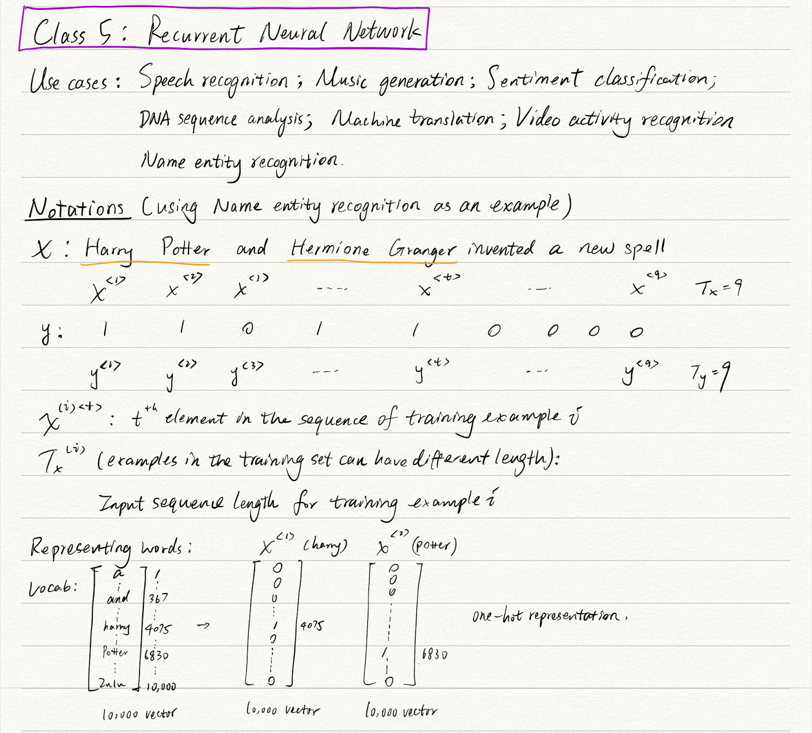
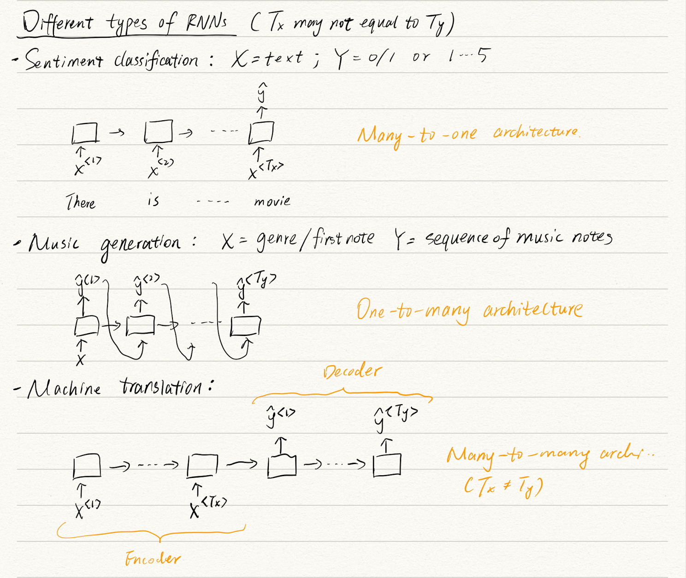
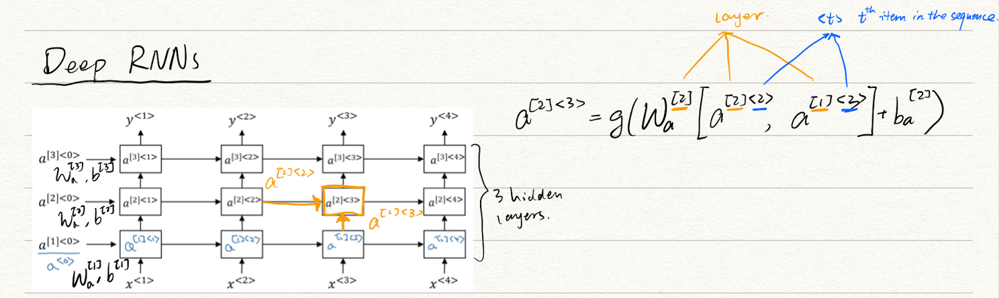
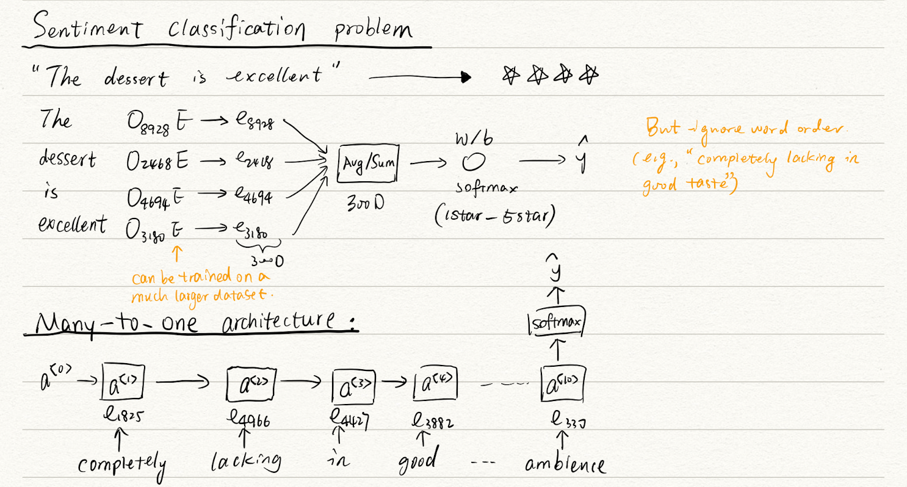
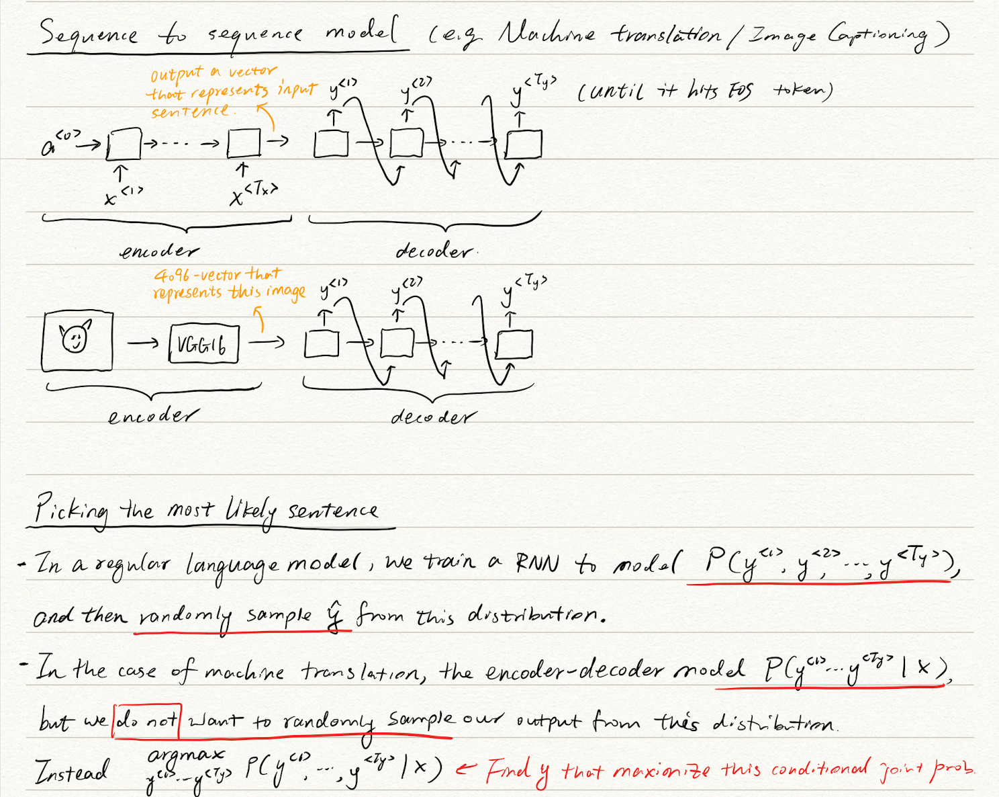
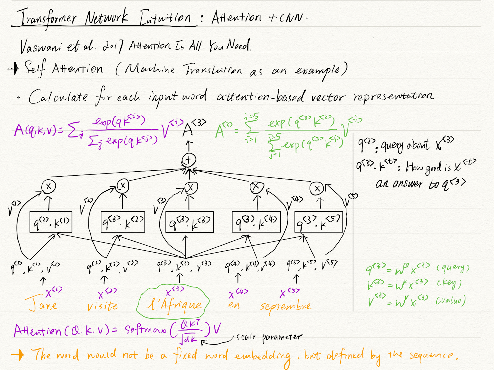

### Table of contents
1. [Intro to Neural Network and Deep Learning](#course1)
    1. [Logistic regression (forward & backward)](#log)
    2. [Neural network representation & activation functions](#nn)
    3. [Gradient descent, Back prop, & DNN](#dnn)
2. [Improving DNN: Hyperparameter tuning, Regularization, & Optimization](#course2)
    1. [General logic for improving DNN](#logic)
    2. [L2 regularization](#l2)
    3. [Dropout and Early-stop](#dropout)
    4. [Normalize inputs](#norminput)
    5. [Vanishing gradient & Initilization](#vanishGrad)
    6. [Gradient checking](#gradcheck)
    7. [Batch & mini-batch gradient descent](#batchgd)
    8. [Optimizers](#opt)
    9. [Learning rate decay](#alphadec)
    10. [Hyperparameter tunning process](#tunepro)
    11. [Batch Normalization](#batchNorm)
    12. [Softmax activation](#softmax)
3. [Structuring machine learning projects](#course3)
    1. [Speeding up the cycle: problem & solutions](#cycle)
    2. [Satificing & Optimizing metrics](#metric)
    3. [Train, Dev, & Test split](#split)
    4. [Error analysis](#error)
    5. [Training & Testing data from different distribution](#dist)
    6. [Transfer learning, Multitask learning, & End-to-end learning](#trick)
4. [Convolutional Neural Network](#course4)
    1. [Convolution as feature detector, padding, & stride](#conv)
    2. [Convolution over volume](#conv2)
    3. [Convolution layer](#convlayer)
    4. [Pooling layer](#pool)
    5. [Classic CNN architecture](#cnnarch)
    6. [Inception CNN and 1x1 convolution](#incep)
    7. [Mobile Net](#mob)
    8. [Sliding window for object detection](#window)
    9. [YOLO algorithm](#yolo)
    10. [Semantic segmentation](#semseg)
    11. [Siamese network & Triplet loss](#oneshot)
    12. [Neural style transfer](#nt)
5. [Recurrent Neural Network](#course5)
    1. [Use cases for RNN](#seq)
    2. [RNN forward & backward](#rnn)
    3. [Different types of RNN](#rnn2)
    4. [Language models & Sampling new text](#lang)
    5. [GRU & LSTM](#grulstm)
    6. [Deep RNN](#deep)
    7. [Word embeddings](#emb)
    8. [Learning embeddings: word2vec & Glove](#emb2)
    9. [Sentiment analysis](#sent)
    10. [Sequence to sequence models](#seq2seq)
    11. [Beam search](#beam)
    12. [Attention mechanism](#atten)
    13. [Transformer architecture](#trans)

## Intro to Neural Network and Deep Learning 

### Logistic regression (forward & backward) 

### Neural network representation & activation functions  

### Gradient descent, Back prop, & DNN 

## Improving DNN: Hyperparameter tuning, Regularization, & Optimization 

### General logic for improving DNN 

### L2 regularization 

### Dropout and Early-stop 

### Normalize inputs 

### Vanishing gradient & Initilization 

### Gradient checking 

### Batch & mini-batch gradient descent 

### Optimizers 

### Learning rate decay 

### Hyperparameter tunning process 

### Batch Normalization 

### Softmax activation 

## Structuring machine learning projects 

### Speeding up the cycle: problem & solutions 

### Satificing & Optimizing metrics 

### Train, Dev, & Test split 

### Error analysis 

### Training & Testing data from different distribution 

### Transfer learning, Multitask learning, & End-to-end learning 

## Convolutional Neural Network 

### Convolution as feature detector, padding, & stride 

### Convolution over volume 

### Convolution layer 

### Pooling layer 

### Classic CNN architecture 

### Inception CNN and 1x1 convolution 

### Mobile Net 

### Sliding window for object detection 

### YOLO algorithm 

### Semantic segmentation 

### Siamese network & Triplet loss 

### Neural style transfer 

## Recurrent Neural Network 

### Use cases for RNN 

### RNN forward & backward 

### Different types of RNN 

### Language models & Sampling new text 

### GRU & LSTM 

### Deep RNN 

### Word embeddings 

### Learning embeddings: word2vec & Glove 

### Sentiment analysis 

### Sequence to sequence models 

### Beam search 

### Attention mechanism 

### Transformer architecture 

