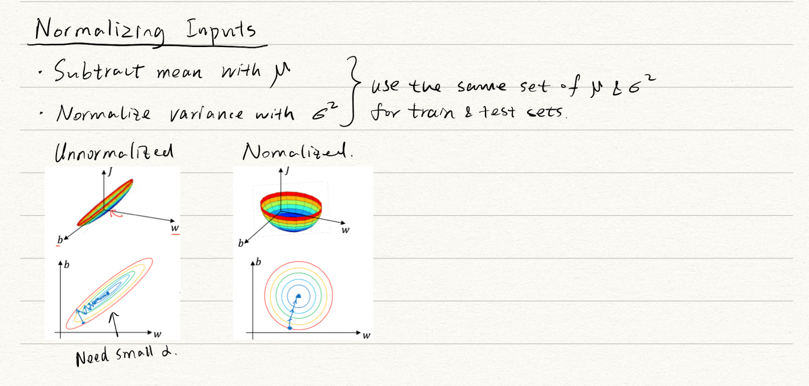

### Table of contents
1. [Intro to Neural Network and Deep Learning](#course1)
    1. [Logistic regression (forward & backward)](#log)
    2. [Neural network representation & activation functions](#nn)
    3. [Gradient descent, Back prop, & DNN](#dnn)
2. [Improving DNN: Hyperparameter tuning, Regularization, & Optimization](#course2)
    1. [General logic for improving DNN](#logic)
    2. [L2 regularization](#l2)
    3. [Dropout and Early-stop](#dropout)
    4. [Normalize inputs](#norminput)
    5. [Vanishing gradient & Initilization](#vanishGrad)
    6. [Gradient checking](#gradcheck)
    7. [Batch & mini-batch gradient descent](#batchgd)
    8. [Optimizers](#opt)
    9. [Learning rate decay](#alphadec)
    10. [Hyperparameter tunning process](#tunepro)
    11. [Batch Normalization](#batchNorm)
    12. [Softmax activation](#softmax)
3. 

## Intro to Neural Network and Deep Learning 

### Logistic regression (forward & backward) 

### Neural network representation & activation functions  

### Gradient descent, Back prop, & DNN 

## Improving DNN: Hyperparameter tuning, Regularization, & Optimization 

### General logic for improving DNN 

### L2 regularization 

### Dropout and Early-stop 

### Normalize inputs 

### Vanishing gradient & Initilization 

### Gradient checking 

### Batch & mini-batch gradient descent 

### Optimizers 

### Learning rate decay 

### Hyperparameter tunning process 

### Batch Normalization 

### Softmax activation 

